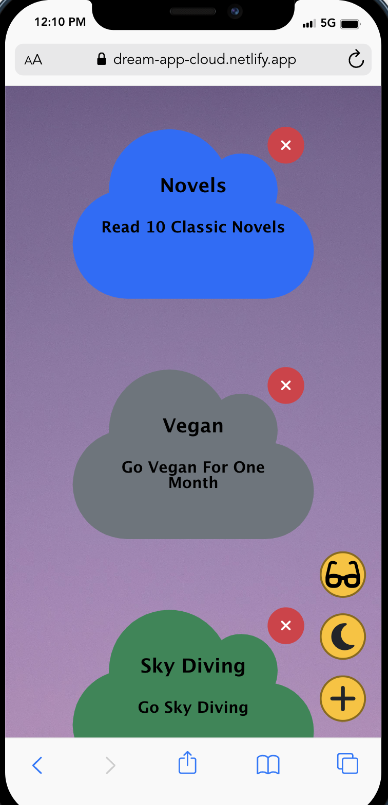

# Dream App

Welcome to my web page project, where I've used HTML, CSS, vanilla JS and mock API to create a beautiful, responsive and interactive web page.

## Project Overview

This web application serves as a user-friendly tool to take notes.

## Screenshots

Here are a couple of screenshots from my project:

## Technologies Used
- HTML
- Vanilla JS
- CSS
- Mock API

### Links
- git clone : https://github.com/Sumeyye-Mete/dream-app.git
- live site URL : https://dream-app-cloud.netlify.app/
